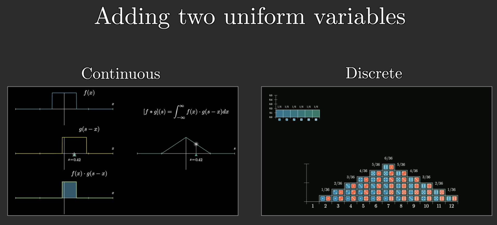
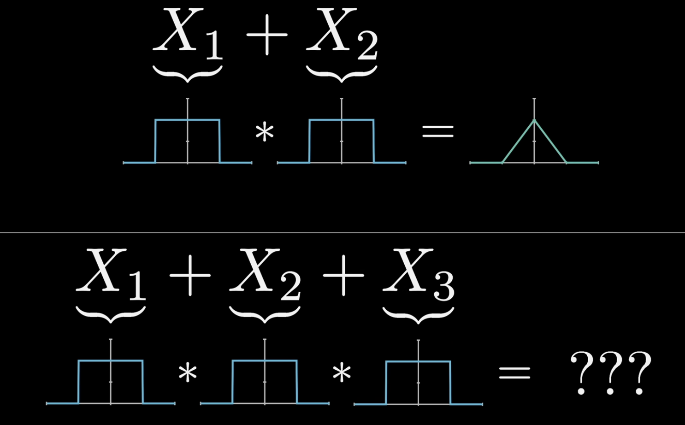
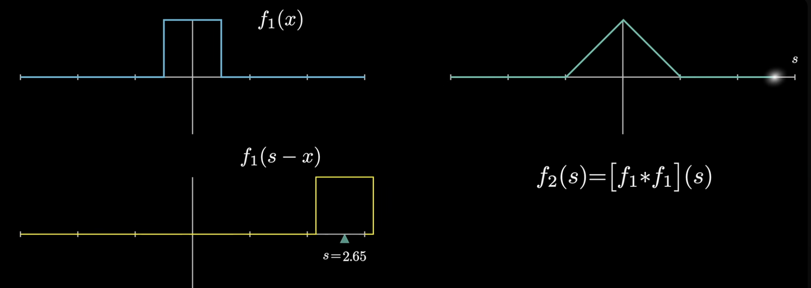
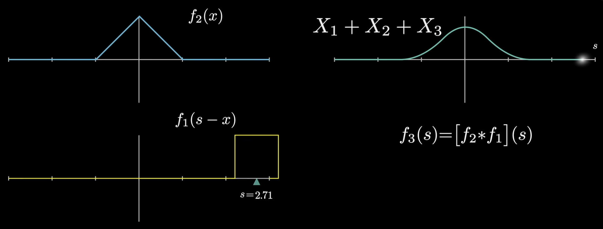
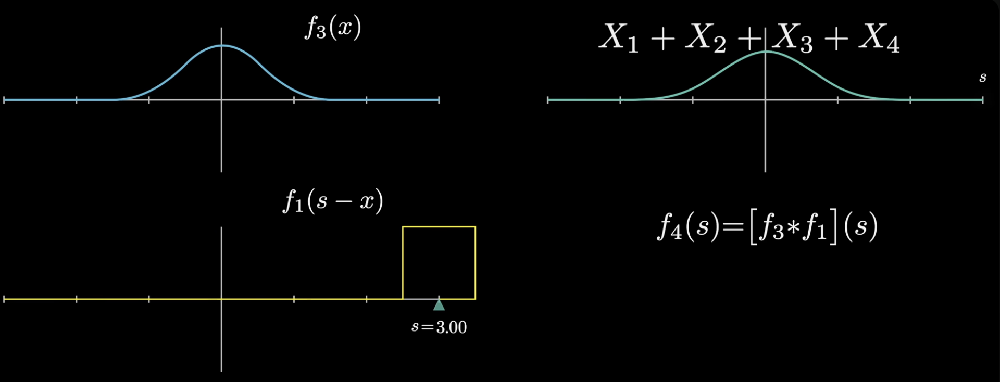
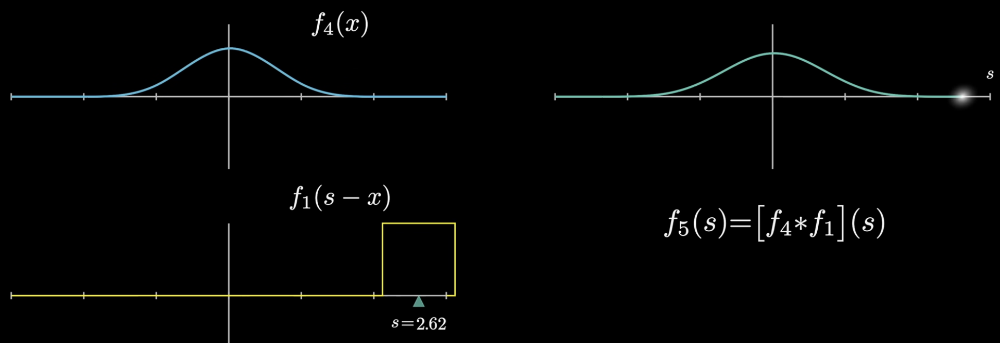
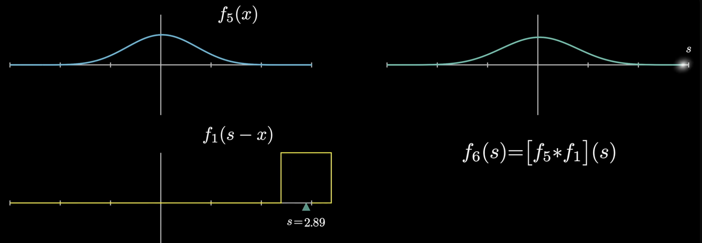
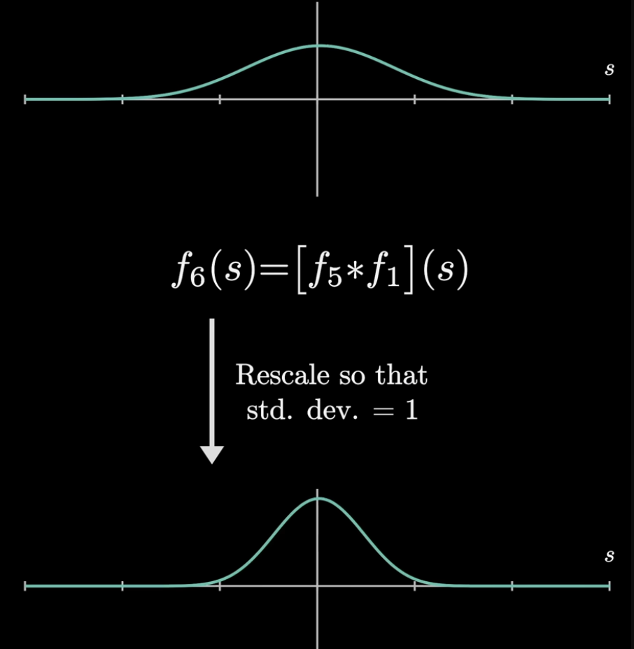

# Convolution (Continuous)

As shown in [Convolution (Discrete)](convolution_discrete.md), there are two equivalent ways to picture convolution: the **flip-and-slide** picture (reverse one function, align it at different offsets, multiply pointwise, and sum), and the **diagonal-slices** picture (form all pairwise products $f(x)\,g(y)$ and collect those with a fixed value of $x + y$).

## From discrete to continuous

We now turn to **continuous** random variables— values anywhere on a continuum such as $\mathbb{R}$ (temperature, financial models, wait times, and similar settings).

On the plot below, $x$ still marks a possible value of the variable, but the vertical axis is no longer probability. It is **probability density**: the probability of falling in an interval is **area** under the curve (see [Continuous Distributions](continuous_distributions.md)). The curve is a **probability density function (PDF)**, often written $f_X(x)$.

Let $X$ and $Y$ be independent continuous random variables with PDFs $f_X$ and $f_Y$, and let $Z = X + Y$.

In the discrete case ([Convolution (Discrete)](convolution_discrete.md)),

$$P(Z = z) = \sum_x f_X(x)\, f_Y(z - x).$$

By the same logic— fix a target sum $s = x + y$, so $y = s - x$, and combine masses with independence. The continuous analogue is

$$(f_X * f_Y)(s) = \int_{-\infty}^{\infty} f_X(x)\, f_Y(s - x)\, dx.$$

The convolution $(f_X * f_Y)$ is the PDF of $Z = X + Y$ when $X$ and $Y$ are independent.

## Visualizing convolution of continuous random variables

The video below visualizes the convolution of two independent continuous random variables $X$ and $Y$ with PDFs $f(x)$ and $g(y)$, and their sum $Z = X + Y$.

For a fixed target sum $s$, the illustration plots $f(x)$ and $g(s - x)$ (the flipped-and-shifted view of the second density)

$$\int_{-\infty}^{\infty} f(x)\, g(s - x)\, dx.$$

It also plots the product $f(x)\, g(s - x)$. **The convolution value at $s$ is the area under that product curve (the integral of the product over $x$).**

<video controls playsinline width="100%">
  <source src="../test_no_audio.mp4" type="video/mp4">
</video>

### Case study: uniform distributions on $[-\tfrac{1}{2}, \tfrac{1}{2}]$

Suppose $X$ and $Y$ are independent and each is uniform on $\bigl[-\tfrac{1}{2}, \tfrac{1}{2}\bigr]$. Each PDF has a **top-hat** shape:

$$f_X(x) = f_Y(x) = \mathbf{1}_{[-\tfrac{1}{2},\, \tfrac{1}{2}]}(x) =
\begin{cases}
1 & \text{if } -\tfrac{1}{2} \le x \le \tfrac{1}{2}, \\
0 & \text{otherwise}.
\end{cases}$$

We want the PDF of $Z = X + Y$, namely $(f_X * f_Y)(s)$.

Because both factors are $0$ or $1$, the product is $1$ on the overlap of their supports and $0$ elsewhere. Since $X, Y \ge -\tfrac{1}{2}$, we must have $Z \ge -1$, so $(f_X * f_Y)(s) = 0$ for $s < -1$.

As we increase $s$, the overlap grows; the area under the product increases **linearly** until the supports align fully, then decreases **linearly** as $s$ increases further. The PDF of $Z$ is therefore **triangular (wedge-shaped)** on $[-1, 1]$.

<video controls playsinline width="100%">
  <source src="../uniformvid.mp4" type="video/mp4">
</video>

This matches the familiar discrete case: the sum of two fair dice is unimodal, with PMF rising to a peak at $7$ and falling again ([Convolution (Discrete)](convolution_discrete.md)).

#### Sum of three independent uniforms

For $Z = X_1 + X_2 + X_3$ with $X_1, X_2, X_3$ i.i.d. on $\bigl[-\tfrac{1}{2}, \tfrac{1}{2}\bigr]$, we do not need a new three-way picture. Let $U = X_1 + X_2$; we already know $U$ has the wedge PDF $f_U$, and

$$f_Z = f_U * f_{X_3},$$

another convolution with the same top-hat PDF $f_{X_3}$.

Multiplying by $f_{X_3}(s - x)$ **windows** the integrand: the product graph is a slice of $f_U$ on an interval of length $1$. As $s$ varies, $(f_U * f_{X_3})(s)$ peaks in the middle and tapers on both sides, but **more smoothly** than $f_U$ alone. Convolving $f_U$ with $f_{X_3}$ is a **moving average** of the wedge density (see the moving-average discussion in [Convolution (Discrete)](convolution_discrete.md)).

<video controls playsinline width="100%">
  <source src="../3uniformvid.mp4" type="video/mp4">
</video>

## The connection to the Central Limit Theorem

We can repeat the same construction. Convolving two top-hat PDFs gave the wedge $f_{S_2}$ for $S_2 = X_1 + X_2$. Convolving $f_{S_2}$ with another top hat gave a smoother $f_{S_3}$ for $S_3 = X_1 + X_2 + X_3$. In general, if $X_1, X_2, \ldots$ are i.i.d. with PDF $f_X$ and $S_n = X_1 + \cdots + X_n$, then

$$f_{S_n} = f_{S_{n-1}} * f_X, \qquad f_{S_1} = f_X.$$

Each step convolves the current sum density with the same $f_X$ (another [moving average](convolution_discrete.md)).

As in [Central Limit Theorem](central_limit_theorem.md), if we keep going, the unscaled curves look more and more bell-shaped. 

Raw repeated convolution also **spreads** the distribution: $\mathrm{Var}(S_n) = n\,\mathrm{Var}(X_1)$, so the peak height shrinks and the graph looks flatter on a fixed $x$-axis. To see the **shape** rather than the scale, we **standardize** at each $n$, for example by plotting

$$\frac{S_n - n\mu}{\sigma\sqrt{n}} \quad \text{where } \mu = E[X_1],\; \sigma^2 = \mathrm{Var}(X_1).$$

After this rescaling, the limit is a standard normal curve rather than a flat spike at zero.

The [Central Limit Theorem](central_limit_theorem.md) says that this is not special to uniforms. For i.i.d. $X_i$ with finite mean $\mu$ and variance $\sigma^2$, the standardized sum

$$\frac{X_1 + \cdots + X_n - n\mu}{\sigma\sqrt{n}}$$

converges in distribution to $\mathcal{N}(0, 1)$ as $n \to \infty$, **no matter what shape** $f_X$ had initially. Equivalently, repeated convolution (bigger and bigger sums) **smooths** the PDF until it is arbitrarily close to a normal density.

<video controls playsinline width="100%">
  <source src="../centrallimittheorem.mp4" type="video/mp4">
</video>

