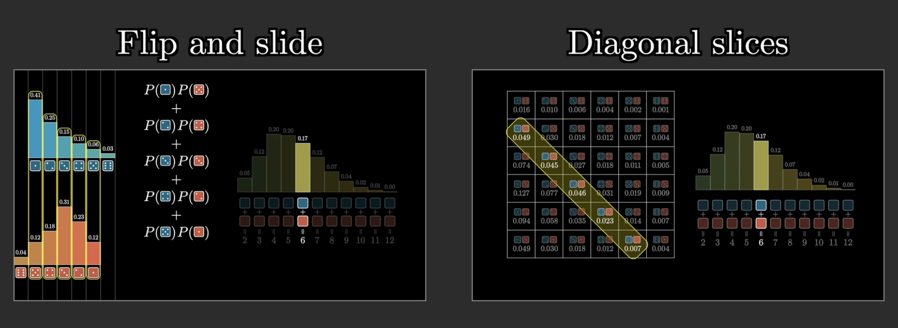
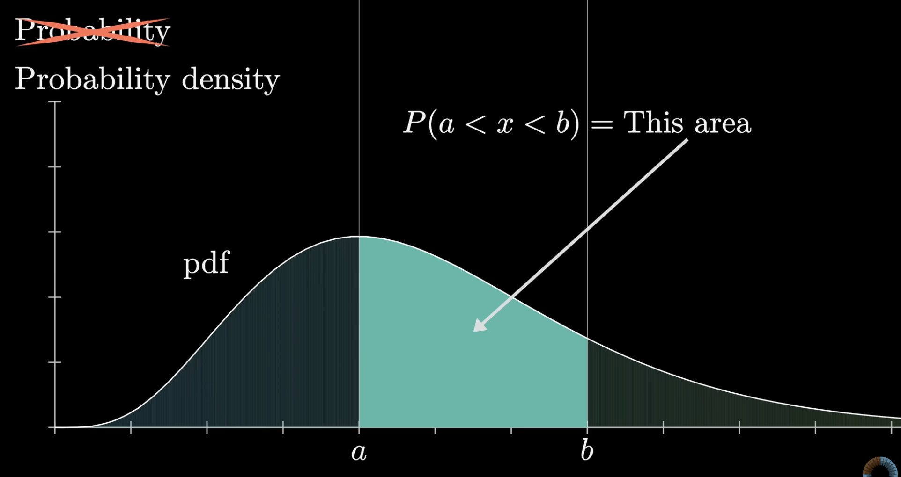
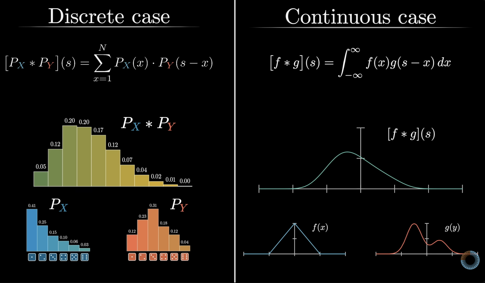

# Convolution (Continuous)

As shown in [Convolution (Discrete)](convolution_discrete.md), there are two equivalent ways to picture convolution: the **flip-and-slide** picture (reverse one function, align it at different offsets, multiply pointwise, and sum), and the **diagonal-slices** picture (form all pairwise products $f(x)\,g(y)$ and collect those with a fixed value of $x + y$).

## From discrete to continuous

We now turn to **continuous** random variables— values anywhere on a continuum such as $\mathbb{R}$ (temperature, financial models, wait times, and similar settings).

On the plot below, $x$ still marks a possible value of the variable, but the vertical axis is no longer probability. It is **probability density**: the probability of falling in an interval is **area** under the curve (see [Continuous Distributions](continuous_distributions.md)). The curve is a **probability density function (PDF)**, often written $f_X(x)$.

Let $X$ and $Y$ be independent continuous random variables with PDFs $f_X$ and $f_Y$, and let $Z = X + Y$.

In the discrete case ([Convolution (Discrete)](convolution_discrete.md)),

$$P(Z = z) = \sum_x f_X(x)\, f_Y(z - x).$$

By the same logic— fix a target sum $s = x + y$, so $y = s - x$, and combine masses with independence. The continuous analogue is

$$(f_X * f_Y)(s) = \int_{-\infty}^{\infty} f_X(x)\, f_Y(s - x)\, dx.$$

The convolution $(f_X * f_Y)$ is the PDF of $Z = X + Y$ when $X$ and $Y$ are independent.

## Visualizing convolution of continuous random variables

The video below visualizes the convolution of two independent continuous random variables $X$ and $Y$ with PDFs $f(x)$ and $g(y)$, and their sum $Z = X + Y$.

For a fixed target sum $s$, the illustration plots $f(x)$ and $g(s - x)$ (the flipped-and-shifted view of the second density)

$$\int_{-\infty}^{\infty} f(x)\, g(s - x)\, dx.$$

It also plots the product $f(x)\, g(s - x)$. **The convolution value at $s$ is the area under that product curve (the integral of the product over $x$).**

<video controls playsinline width="100%">
  <source src="../test_no_audio.mp4" type="video/mp4">
</video>