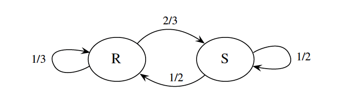
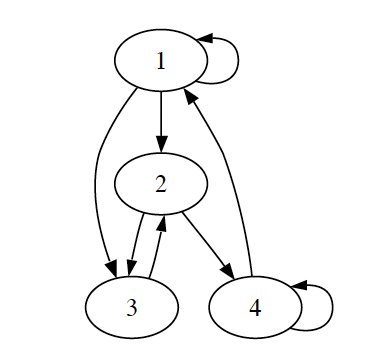

# Markov Chains

## Introduction

To see where the Markov chain comes from, start by considering an **i.i.d. sequence** of random variables $X_0, X_1, \ldots, X_n, \ldots$ where we think of $n$ as time. An i.i.d. sequence has **no dependence** between any of the random variables- each $X_n$ is independent of all previous values. A Markov chain is a sequence
of r.v.s that exhibits one-step dependence.

### State Space and Time

Markov chains "live" in both **space** and **time**.

- **State Space**: The set of all possible values that the random variables $X_n$ can take

- **Time**: The index $n$ represents the evolution of some process over time

**1. State Space Type:**

- **Discrete State Space**: States take values from a countable set (finite or infinite)

- **Continuous State Space**: States take values from a continuous set (e.g., real numbers)

**2. Time Type:**

- **Discrete Time**: Process evolves at discrete time steps ($n = 0, 1, 2, \ldots$)

- **Continuous Time**: Process evolves continuously over time ($t \geq 0$)

### Definition (Markov chain)

A sequence of random variables $X_0, X_1, X_2, \ldots$ taking values in the state space $\{1, 2, \ldots, M\}$ is called a Markov chain if for all $n \geq 0$,

$$P(X_{n+1} = j | X_n = i, X_{n-1} = i_{n-1}, \ldots, X_0 = i_0) = P(X_{n+1} = j | X_n = i)$$

The quantity $P(X_{n+1} = j | X_n = i)$ is called the **transition probability** from state $i$ to state $j$.

If we think of time $n$ as the present, times before $n$ as the past, and times after $n$ as the future, the Markov property says that given the present, the past and future are conditionally independent. The Markov property greatly simplifies computations of conditional probability: instead of having to condition on the entire past, we only need to condition on the most recent value.

## Transition matrix

**Definition (Transition matrix):** Let $X_0, X_1, X_2, \ldots$ be a Markov chain with state space $\{1, 2, \ldots, M\}$, and let $q_{ij} = P(X_{n+1} = j | X_n = i)$ be the transition probability from state $i$ to state $j$. The $M \times M$ matrix $Q = (q_{ij})$ is called the **transition matrix** of the chain.

Note that $Q$ is a nonnegative matrix in which each row sums to 1. This is because, starting from any state $i$, the events "move to 1", "move to 2", $\ldots$, "move to $M$" are disjoint, and their union has probability 1 because the chain has to go somewhere.

**Example:** Suppose that on any given day, the weather can either be rainy or sunny. If today is rainy, then tomorrow will be rainy with probability $1/3$ and sunny with probability $2/3$. If today is sunny, then tomorrow will be rainy with probability $1/2$ and sunny with probability $1/2$. Letting $X_n$ be the weather on day $n$, $X_0, X_1, X_2, \ldots$ is a Markov chain on the state space $\{R, S\}$, where $R$ stands for rainy and $S$ for sunny. We know that the Markov property is satisfied because, from the description of the process, only today's weather matters for predicting tomorrow's.

The transition matrix of the chain is

$$\begin{array}{c|cc}
 & R & S \\
\hline
R & 1/3 & 2/3 \\
S & 1/2 & 1/2 \\
\end{array}$$

The transition probabilities of a Markov chain can also be represented with a diagram. Each state is represented by a circle, and the arrows indicate the possible one-step transitions; we can imagine a particle wandering around from state to state, randomly choosing which arrow to follow. Next to the arrows we write the corresponding transition probabilities.

Let's trace through a specific realization of the rainy-sunny Markov chain. Suppose we start with $X_0 = R$ (rainy on day 0) and simulate the next 5 days:

**Day-by-day evolution:**

- $X_0 = R$ (start rainy)

- $X_1 = S$ (transition: R→S with probability 2/3)

- $X_2 = R$ (transition: S→R with probability 1/2)  

- $X_3 = S$ (transition: R→S with probability 2/3)

- $X_4 = S$ (transition: S→S with probability 1/2)

- $X_5 = R$ (transition: S→R with probability 1/2)

**Key observations:**

- Each transition depends only on the current state (Markov property)

- This is just one possible realization - different runs would produce different sequences

- The probabilities at each step are determined by the transition matrix

## n-Step Transition Probabilities

Once we have the transition matrix $Q$ of a Markov chain, we can work out the transition probabilities for longer timescales.

**Definition (n-step transition probability):** The n-step transition probability from $i$ to $j$ is the probability of being at $j$ exactly $n$ steps after being at $i$. We denote this by $q^{(n)}_{ij}$:

$$q^{(n)}_{ij} = P(X_n = j | X_0 = i)$$

Note that

$$q^{(2)}_{ij} = \sum_k q_{ik} q_{kj}$$

since to get from $i$ to $j$ in two steps, the chain must go from $i$ to some intermediary state $k$, and then from $k$ to $j$; these transitions are independent because of the Markov property. Since the right-hand side is the $(i, j)$ entry of $Q^2$ by definition of matrix multiplication, we conclude that the matrix $Q^2$ gives the two-step transition probabilities.

**Example:** For our rainy-sunny Markov chain with transition matrix:

$$Q = \begin{pmatrix}
1/3 & 2/3 \\
1/2 & 1/2 \\
\end{pmatrix}$$

The two-step transition matrix is:

$$Q^2 = \begin{pmatrix}
1/3 & 2/3 \\
1/2 & 1/2 \\
\end{pmatrix} \begin{pmatrix}
1/3 & 2/3 \\
1/2 & 1/2 \\
\end{pmatrix} = \begin{pmatrix}
\frac{1}{3} \cdot \frac{1}{3} + \frac{2}{3} \cdot \frac{1}{2} & \frac{1}{3} \cdot \frac{2}{3} + \frac{2}{3} \cdot \frac{1}{2} \\
\frac{1}{2} \cdot \frac{1}{3} + \frac{1}{2} \cdot \frac{1}{2} & \frac{1}{2} \cdot \frac{2}{3} + \frac{1}{2} \cdot \frac{1}{2} \\
\end{pmatrix}$$

$$= \begin{pmatrix}
\frac{1}{9} + \frac{1}{3} & \frac{2}{9} + \frac{1}{3} \\
\frac{1}{6} + \frac{1}{4} & \frac{1}{3} + \frac{1}{4} \\
\end{pmatrix} = \begin{pmatrix}
\frac{1}{9} + \frac{3}{9} & \frac{2}{9} + \frac{3}{9} \\
\frac{2}{12} + \frac{3}{12} & \frac{4}{12} + \frac{3}{12} \\
\end{pmatrix} = \begin{pmatrix}
\frac{4}{9} & \frac{5}{9} \\
\frac{5}{12} & \frac{7}{12} \\
\end{pmatrix}$$

Let's compute $q^{(2)}_{RS}$ (starting rainy, ending sunny after 2 steps) using the formula $q^{(2)}_{ij} = \sum_k q_{ik} q_{kj}$:

$$q^{(2)}_{RS} = \sum_{k} q_{Rk} q_{kS} = q_{RR} \cdot q_{RS} + q_{RS} \cdot q_{SS}$$

Substituting the values from our transition matrix:

$$q^{(2)}_{RS} = \frac{1}{3} \cdot \frac{2}{3} + \frac{2}{3} \cdot \frac{1}{2} = \frac{2}{9} + \frac{1}{3} = \frac{2}{9} + \frac{3}{9} = \frac{5}{9}$$

The total probability is $\frac{5}{9}$.

**Verification:** The $(R,S)$ entry is indeed $\frac{5}{9}$, which matches our calculation!

By induction, the $n$th power of the transition matrix gives the $n$-step transition probabilities:

$q^{(n)}_{ij}$ is the $(i, j)$ entry of $Q^n$.

## Conditional Distributions encoded in Transition Matrices

The transition matrix $Q$ encodes the conditional distribution of $X_1$ given the initial state of the chain. Specifically, the $i$th row of $Q$ is the conditional PMF of $X_1$ given $X_0 = i$, displayed as a row vector. Similarly, the $i$th row of $Q^n$ is the conditional PMF of $X_n$ given $X_0 = i$.

**Example:** For our rainy-sunny Markov chain with transition matrix:

$$Q = \begin{pmatrix}
1/3 & 2/3 \\
1/2 & 1/2 \\
\end{pmatrix}$$

**One-step conditional distributions:**

- **Given $X_0 = R$ (rainy)**: The first row $(1/3, 2/3)$ gives the conditional PMF of $X_1$:
  - $P(X_1 = R | X_0 = R) = 1/3$
  - $P(X_1 = S | X_0 = R) = 2/3$

- **Given $X_0 = S$ (sunny)**: The second row $(1/2, 1/2)$ gives the conditional PMF of $X_1$:
  - $P(X_1 = R | X_0 = S) = 1/2$
  - $P(X_1 = S | X_0 = S) = 1/2$

**Two-step conditional distributions:**

From our calculated $Q^2 = \begin{pmatrix} 4/9 & 5/9 \\ 5/12 & 7/12 \end{pmatrix}$:

- **Given $X_0 = R$**: The first row $(4/9, 5/9)$ gives the conditional PMF of $X_2$:
  - $P(X_2 = R | X_0 = R) = 4/9$
  - $P(X_2 = S | X_0 = R) = 5/9$

- **Given $X_0 = S$**: The second row $(5/12, 7/12)$ gives the conditional PMF of $X_2$:
  - $P(X_2 = R | X_0 = S) = 5/12$
  - $P(X_2 = S | X_0 = S) = 7/12$

**Key insight:** Each row of $Q^n$ sums to 1, representing a valid probability distribution over the state space, conditioned on the initial state.

## Marginal Distributions

To get the marginal distributions of $X_0, X_1, \ldots$, we need to specify not only the transition matrix, but also the initial conditions of the chain. The initial state $X_0$ can be specified deterministically, or randomly according to some distribution. Let $(t_1, t_2, \ldots, t_M)$ be the PMF of $X_0$ displayed as a vector, that is, $t_i = P(X_0 = i)$. Then the marginal distribution of the chain at any time can be computed from the transition matrix, averaging over all the states using LOTP.

**Important note:** The initial distribution vector $t$ is completely independent of the transition matrix $Q$. The vector $t$ specifies how the chain starts (the probabilities of being in each state at time 0), while $Q$ specifies how the chain evolves from one time step to the next. We can choose any initial distribution $t$ we want - it doesn't need to be related to $Q$ in any way. For example, we could start deterministically in state 1 with $t = (1, 0, 0, 0)$, or with any other probability distribution over the four states.

**Proposition (Marginal distribution of $X_n$):** Define $t = (t_1, t_2, \ldots, t_M)$ by $t_i = P(X_0 = i)$, and view $t$ as a row vector. Then the marginal distribution of $X_n$ is given by the vector $tQ^n$. That is, the $j$th component of $tQ^n$ is $P(X_n = j)$.

**Proof:** By the law of total probability, conditioning on $X_0$, the probability that the chain is in state $j$ after $n$ steps is

$$P(X_n = j) = \sum_{i=1}^{M} P(X_0 = i)P(X_n = j | X_0 = i) = \sum_{i=1}^{M} t_i q^{(n)}_{ij}$$

which is the $j$th component of $tQ^n$ by definition of matrix multiplication.

**Example (Marginal distributions of 4-state Markov chain):** Consider the 4-state Markov chain shown in the figure below. 

Suppose that the initial conditions are $t = (1/4, 1/4, 1/4, 1/4)$, meaning that the chain has equal probability of starting in each of the four states. When no probabilities are written over the arrows, as in this case, it means all arrows originating from a given state are equally likely. For example, there are 3 arrows originating from state 1, so the transitions 1->3, 1->2, and 1->1 all have probability 1/3.Let $X_n$ be the position of the chain at time $n$. Then the marginal distribution of $X_1$ is

$$tQ = \begin{pmatrix}
1/4 & 1/4 & 1/4 & 1/4 \\
\end{pmatrix} \begin{pmatrix}
1/3 & 1/3 & 1/3 & 0 \\
0 & 0 & 1/2 & 1/2 \\
0 & 1 & 0 & 0 \\
1/2 & 0 & 0 & 1/2 \\
\end{pmatrix} = \begin{pmatrix}
5/24 & 1/3 & 5/24 & 1/4 \\
\end{pmatrix}$$

The marginal distribution of $X_5$ is

$$tQ^5 = \begin{pmatrix}
1/4 & 1/4 & 1/4 & 1/4 \\
\end{pmatrix} \begin{pmatrix}
853/3888 & 509/1944 & 52/243 & 395/1296 \\
173/864 & 85/432 & 31/108 & 91/288 \\
37/144 & 29/72 & 1/9 & 11/48 \\
499/2592 & 395/1296 & 71/324 & 245/864 \\
\end{pmatrix} = \begin{pmatrix}
3379/15552 & 2267/7776 & 101/486 & 1469/5184 \\
\end{pmatrix}$$
