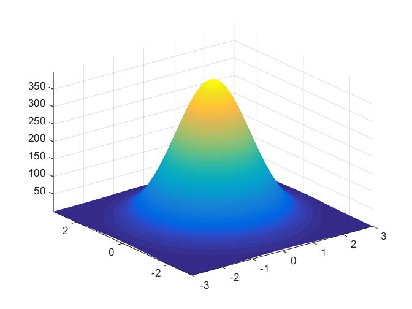

# Multivariate Normal Distribution

The multivariate normal distribution is a generalization of the univariate normal distribution to multiple dimensions. It's one of the most important distributions in statistics and machine learning, serving as the foundation for many statistical methods and models.

## Definition

A random vector $\mathbf{X} = (X_1, X_2, \ldots, X_d)^T$ follows a **multivariate normal distribution** with mean vector $\boldsymbol{\mu} \in \mathbb{R}^d$ and covariance matrix $\boldsymbol{\Sigma} \in \mathbb{R}^{d \times d}$ (denoted as $\mathbf{X} \sim \mathcal{N}(\boldsymbol{\mu}, \boldsymbol{\Sigma})$) if its probability density function is:

$$f(\mathbf{x}) = \frac{1}{(2\pi)^{d/2}|\boldsymbol{\Sigma}|^{1/2}} \exp\left(-\frac{1}{2}(\mathbf{x} - \boldsymbol{\mu})^T \boldsymbol{\Sigma}^{-1} (\mathbf{x} - \boldsymbol{\mu})\right)$$

where:

- $\mathbf{x} = (x_1, x_2, \ldots, x_d)^T$ is a $d$-dimensional vector

- $\boldsymbol{\mu} = (\mu_1, \mu_2, \ldots, \mu_d)^T$ is the mean vector

- $\boldsymbol{\Sigma}$ is the covariance matrix

- $|\boldsymbol{\Sigma}|$ denotes the determinant of $\boldsymbol{\Sigma}$

**Important**: This PDF $f(\mathbf{x})$ is the **joint probability density function** of the random variables $X_1, X_2, \ldots, X_d$ in the vector. That is, $f(x_1, x_2, \ldots, x_d)$ gives the joint density of all $d$ random variables simultaneously.

**Alternative Definition**

A random vector $\mathbf{X} = (X_1, X_2, \ldots, X_d)^T$ follows a multivariate normal distribution if and only if **every linear combination** of its components is univariate normal. That is, for any constants $t_1, t_2, \ldots, t_d \in \mathbb{R}$ (not all zero), the random variable:

$$Y = t_1X_1 + t_2X_2 + \cdots + t_dX_d$$

follows a univariate normal distribution.

**Mean Vector $\boldsymbol{\mu}$:**

The mean vector contains the expected values of each component:

$$\boldsymbol{\mu} = E[\mathbf{X}] = (E[X_1], E[X_2], \ldots, E[X_d])^T$$

**Covariance Matrix $\boldsymbol{\Sigma}$:**

The covariance matrix captures the relationships between variables:

$$\boldsymbol{\Sigma}_{ij} = \text{Cov}(X_i, X_j) = E[(X_i - \mu_i)(X_j - \mu_j)]$$

**Properties of $\boldsymbol{\Sigma}$**:

- **Symmetric**: $\boldsymbol{\Sigma} = \boldsymbol{\Sigma}^T$

- **Positive definite**: $\mathbf{v}^T \boldsymbol{\Sigma} \mathbf{v} > 0$ for all non-zero vectors $\mathbf{v}$

- **Diagonal elements**: $\boldsymbol{\Sigma}_{ii} = \text{Var}(X_i) = \sigma_i^2$

## Properties

**1. Linear Transformations**

If $\mathbf{X} \sim \mathcal{N}(\boldsymbol{\mu}, \boldsymbol{\Sigma})$ and $\mathbf{Y} = \mathbf{A}\mathbf{X} + \mathbf{b}$, then:

$$\mathbf{Y} \sim \mathcal{N}(\mathbf{A}\boldsymbol{\mu} + \mathbf{b}, \mathbf{A}\boldsymbol{\Sigma}\mathbf{A}^T)$$

**2. Marginal Distributions**

Any subset of components follows a multivariate normal distribution. For example, if $\mathbf{X} = (X_1, X_2, X_3)^T \sim \mathcal{N}(\boldsymbol{\mu}, \boldsymbol{\Sigma})$, then:

$$(X_1, X_2)^T \sim \mathcal{N}\left(\begin{pmatrix} \mu_1 \\ \mu_2 \end{pmatrix}, \begin{pmatrix} \sigma_1^2 & \sigma_{12} \\ \sigma_{12} & \sigma_2^2 \end{pmatrix}\right)$$

## Case study: Bivariate Normal Distribution ($d = 2$)

For two variables $X_1$ and $X_2$:

$$\mathbf{X} = \begin{pmatrix} X_1 \\ X_2 \end{pmatrix} \sim \mathcal{N}\left(\begin{pmatrix} \mu_1 \\ \mu_2 \end{pmatrix}, \begin{pmatrix} \sigma_1^2 & \sigma_{12} \\ \sigma_{12} & \sigma_2^2 \end{pmatrix}\right)$$

The joint density becomes:

$$f(x_1, x_2) = \frac{1}{2\pi\sqrt{\sigma_1^2\sigma_2^2 - \sigma_{12}^2}} \exp\left(-\frac{1}{2(\sigma_1^2\sigma_2^2 - \sigma_{12}^2)}\left[\sigma_2^2(x_1-\mu_1)^2 - 2\sigma_{12}(x_1-\mu_1)(x_2-\mu_2) + \sigma_1^2(x_2-\mu_2)^2\right]\right)$$

**Note**: The determinant of the covariance matrix is $|\boldsymbol{\Sigma}| = \sigma_1^2\sigma_2^2 - \sigma_{12}^2$, and the inverse covariance matrix is:

$$\boldsymbol{\Sigma}^{-1} = \frac{1}{\sigma_1^2\sigma_2^2 - \sigma_{12}^2}\begin{pmatrix} \sigma_2^2 & -\sigma_{12} \\ -\sigma_{12} & \sigma_1^2 \end{pmatrix}$$

