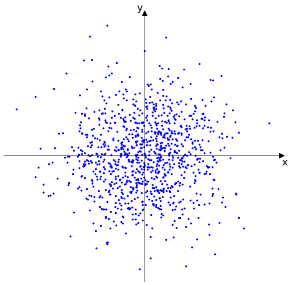
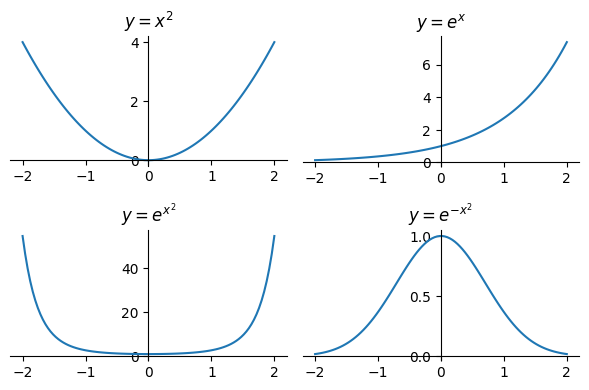
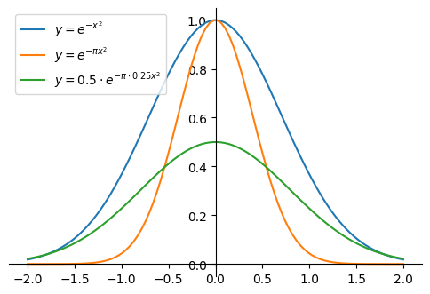

# Normal Distribution

The **Normal distribution** (also called the **Gaussian distribution**) is one of the most important continuous distributions in probability and statistics. It appears naturally in many contexts due to the [Central Limit Theorem](central_limit_theorem.md) and provides a foundation for many statistical methods.

## Standard Normal Distribution

A continuous random variable $Z$ is said to have the **standard Normal distribution** if its PDF $f_Z$ is given by:

$$f_Z(z) = \frac{1}{\sqrt{2\pi}} e^{-z^2/2}, \quad -\infty < z < \infty$$

We write this as $Z \sim N(0, 1)$ since, as we will show, $Z$ has mean 0 and variance 1.

The constant $\frac{1}{\sqrt{2\pi}}$ in front of the PDF may look surprising (why is something with $\pi$ needed in front of something with $e$, when there are no circles in sight?), but it's exactly what is needed to make the PDF integrate to 1. Such constants are called **normalizing constants** because they normalize the total area under the PDF to 1.

By symmetry, the mean of the standard normal distribution is 0. Here's why:

The standard normal PDF is symmetric about 0:

$$f_Z(z) = f_Z(-z) \quad \text{for all } z$$

This means the distribution looks the same on both sides of 0. The mean is defined as:

$$E[Z] = \int_{-\infty}^{\infty} z \cdot f_Z(z) \, dz$$

Let's split this integral into two parts:

$$E[Z] = \int_{-\infty}^0 z \cdot f_Z(z) \, dz + \int_0^{\infty} z \cdot f_Z(z) \, dz$$

**First integral** ($-\infty$ to 0): Let $u = -z$, so $z = -u$ and $dz = -du$

$$\int_{-\infty}^0 z \cdot f_Z(z) \, dz = \int_{\infty}^0 (-u) \cdot f_Z(-u) \cdot (-du) = \int_0^{\infty} u \cdot f_Z(u) \, du$$

**Second integral** (0 to $\infty$): This is already in the right form

$$\int_0^{\infty} z \cdot f_Z(z) \, dz$$

$$E[Z] = \int_0^{\infty} u \cdot f_Z(u) \, du + \int_0^{\infty} z \cdot f_Z(z) \, dz$$

Since $u$ and $z$ are just dummy variables, we can write this as:

$$E[Z] = \int_0^{\infty} z \cdot f_Z(z) \, dz + \int_0^{\infty} z \cdot f_Z(z) \, dz = 2 \int_0^{\infty} z \cdot f_Z(z) \, dz$$

The integrand $z \cdot f_Z(z)$ is **odd** because:

- $f_Z(z) = f_Z(-z)$ (even function)

- $z$ is odd

- Product of even and odd functions is odd

For odd functions, the integral from $-\infty$ to $\infty$ equals 0.

Therefore, $E[Z] = 0$.

Now let's show that the variance of the standard normal distribution is 1. The variance is defined as:

$$\text{Var}(Z) = E[(Z - E[Z])^2] = E[Z^2]$$

Since we already showed that $E[Z] = 0$, we have $\text{Var}(Z) = E[Z^2]$.

Calculating $E[Z^2]$:

$$E[Z^2] = \int_{-\infty}^{\infty} z^2 \cdot f_Z(z) \, dz = \int_{-\infty}^{\infty} z^2 \cdot \frac{1}{\sqrt{2\pi}} e^{-z^2/2} \, dz$$

Let's use integration by parts with:

- $u = z$ and $dv = z \cdot \frac{1}{\sqrt{2\pi}} e^{-z^2/2} \, dz$

- $du = dz$ and $v = -\frac{1}{\sqrt{2\pi}} e^{-z^2/2}$

**Integration by parts formula**: $\int u \, dv = uv - \int v \, du$

$$E[Z^2] = \left[z \cdot \left(-\frac{1}{\sqrt{2\pi}} e^{-z^2/2}\right)\right]_{-\infty}^{\infty} - \int_{-\infty}^{\infty} \left(-\frac{1}{\sqrt{2\pi}} e^{-z^2/2}\right) \, dz$$

The boundary term evaluates to 0:

- **At $z = \infty$**: $z \cdot e^{-z^2/2} \to 0$ (exponential decay dominates)

- **At $z = -\infty$**: $z \cdot e^{-z^2/2} \to 0$ (exponential decay dominates)

Therefore:

$$E[Z^2] = 0 - \int_{-\infty}^{\infty} \left(-\frac{1}{\sqrt{2\pi}} e^{-z^2/2}\right) \, dz = \int_{-\infty}^{\infty} \frac{1}{\sqrt{2\pi}} e^{-z^2/2} \, dz$$

The remaining integral is exactly the integral of the PDF from $-\infty$ to $\infty$, which equals 1:

$$E[Z^2] = \int_{-\infty}^{\infty} \frac{1}{\sqrt{2\pi}} e^{-z^2/2} \, dz = 1$$

Therefore, $\text{Var}(Z) = E[Z^2] = 1$.

The standard Normal CDF $\Phi$ is the accumulated area under the PDF:

$$\Phi(z) = \int_{-\infty}^z f_Z(t) \, dt = \int_{-\infty}^z \frac{1}{\sqrt{2\pi}} e^{-t^2/2} \, dt$$

Some people, upon seeing the function $\Phi$ for the first time, express dismay that it is left in terms of an integral. Unfortunately, we have little choice in the matter: it turns out to be mathematically impossible to find a closed-form expression for the antiderivative of $f_Z$, meaning that we cannot express $\Phi$ as a finite sum of more familiar functions like polynomials or exponentials. But closed-form or no, it's still a well-defined function: if we give $\Phi$ an input $z$, it returns the accumulated area under the PDF from $-\infty$ up to $z$.

## General Normal Distribution

The **general Normal distribution** with mean $\mu$ and standard deviation $\sigma$ (or variance $\sigma^2$) is obtained by applying a linear transformation to the standard normal distribution. If $Z \sim N(0, 1)$ is a standard normal random variable, then:

$$X = \mu + \sigma Z$$

has a normal distribution with mean $\mu$ and standard deviation $\sigma$. We write this as $X \sim N(\mu, \sigma^2)$.

**Mean and Variance**: 

- $E[X] = E[\mu + \sigma Z] = \mu + \sigma E[Z] = \mu + \sigma \cdot 0 = \mu$

- $\text{Var}(X) = \text{Var}(\mu + \sigma Z) = \sigma^2 \text{Var}(Z) = \sigma^2 \cdot 1 = \sigma^2$

**CDF**: The CDF of $X \sim N(\mu, \sigma^2)$ is:

$$F_X(x) = \Phi\left(\frac{x - \mu}{\sigma}\right)$$

where $\Phi$ is the standard normal CDF.

**Derivation of the CDF**: Since $X = \mu + \sigma Z$, we can find the CDF by:

$$F_X(x) = P(X \leq x) = P(\mu + \sigma Z \leq x) = P\left(Z \leq \frac{x - \mu}{\sigma}\right) = \Phi\left(\frac{x - \mu}{\sigma}\right)$$

**PDF**: The PDF of $X \sim N(\mu, \sigma^2)$ is:

$$f_X(x) = \frac{1}{\sigma \sqrt{2\pi}} e^{-\frac{(x-\mu)^2}{2\sigma^2}}, \quad -\infty < x < \infty$$

**Derivation of the PDF from the CDF**: We can derive the PDF by taking the derivative of the CDF with respect to $x$:

$$f_X(x) = \frac{d}{dx} F_X(x) = \frac{d}{dx} \Phi\left(\frac{x - \mu}{\sigma}\right)$$

Using the chain rule and the fact that $\frac{d}{dz} \Phi(z) = \phi(z)$ (where $\phi(z)$ is the standard normal PDF):

$$f_X(x) = \phi\left(\frac{x - \mu}{\sigma}\right) \cdot \frac{d}{dx}\left(\frac{x - \mu}{\sigma}\right)$$

Since $\frac{d}{dx}\left(\frac{x - \mu}{\sigma}\right) = \frac{1}{\sigma}$, we have:

$$f_X(x) = \phi\left(\frac{x - \mu}{\sigma}\right) \cdot \frac{1}{\sigma}$$

Substituting the standard normal PDF $\phi(z) = \frac{1}{\sqrt{2\pi}} e^{-z^2/2}$:

$$f_X(x) = \frac{1}{\sqrt{2\pi}} e^{-\frac{(x-\mu)^2}{2\sigma^2}} \cdot \frac{1}{\sigma} = \frac{1}{\sigma \sqrt{2\pi}} e^{-\frac{(x-\mu)^2}{2\sigma^2}}$$

**Standardization**: Any normal random variable $X \sim N(\mu, \sigma^2)$ can be standardized to a standard normal by:

$$Z = \frac{X - \mu}{\sigma} \sim N(0, 1)$$

This is the inverse of the transformation $X = \mu + \sigma Z$.

## Herschel-Maxwell derivation of the normal distribution

The [Central Limit Theorem](central_limit_theorem.md) explains why **sums** of many small independent effects tend toward normality.
The **Herschel–Maxwell derivation** is a different classical route: it **characterizes** the bell curve from **independence** and **rotational symmetry** alone.

### Herschel's experiment

Herschel imagined a ball dropped many times toward a fixed mark in the plane.
Each landing point has coordinates $(X, Y)$ measuring the error in the horizontal and vertical directions relative to the mark (origin).

After many trials, we model $(X, Y)$ by a **joint PDF** $p(x, y)$.

### Two postulates

1. **Independence** of the coordinate errors:
   
$$p(x, y) = f(x)\, f(y).$$

2. **Isotropy** (rotational symmetry): the joint density depends only on the distance from the origin, not on the angle. With $r = \sqrt{x^2 + y^2}$,

$$p(x, y) = g(r) = g\!\left(\sqrt{x^2 + y^2}\right).$$

Combining the postulates,

$$f(x)\, f(y) = g\!\left(\sqrt{x^2 + y^2}\right).$$

### Reducing to one function

Set $y = 0$. Then $g(x) = f(x)\, f(0)$, so $g$ can be expressed using $f$ alone.
Substitute $g\!\left(\sqrt{x^2 + y^2}\right) = f\!\left(\sqrt{x^2 + y^2}\right)\, f(0)$ into the combined equation and divide by $f(0)^2$:

$$\frac{f(x)}{f(0)} \cdot \frac{f(y)}{f(0)} = \frac{f\!\left(\sqrt{x^2 + y^2}\right)}{f(0)}.$$

Define $h(x) = f(x)/f(0)$. Then

$$h(x)\, h(y) = h\!\left(\sqrt{x^2 + y^2}\right). \tag{*}$$

### Why $h$ must be a Gaussian-shaped exponential

Clearly $h(x)$ is a composition of the square and an exponential function.
The base of the exponential does not matter; the important point is the relationship

$$b^x \cdot b^y = b^{x+y}.$$

Since $b^x = (c^{\log_c b})^x = c^{(\log_c b)\, x}$, we can pick a base and introduce a constant $a$ that allows us to switch to any base:

$$h(x) = e^{a x^2}.$$

After expanding $h(x)$ again, we solve for $f(x)$:

$$f(x) = f(0)\, e^{a x^2}.$$

We know that $x^2$ is always non-negative and that the exponential function grows indefinitely for positive values when the exponent is positive.

However, we want to derive a probability distribution, so $a$ must be less than zero.
Write $a = -b^2$ and let $c = f(0)$:

$$f(x) = c\, e^{-b^2 x^2}.$$

Now the maximum of each $f(x)$ is at $x = 0$, and the functions are symmetric around their maximum.
Our formula describes a family of bell-shaped functions.

### Normalization

For $f$ to be a PDF,

$$\int_{-\infty}^{\infty} f(x)\, dx = c \int_{-\infty}^{\infty} e^{-b^2 x^2}\, dx = 1.$$

Substitute $u = b x$, $du = b\, dx$:

$$c \int_{-\infty}^{\infty} e^{-b^2 x^2}\, dx = \frac{c}{b} \int_{-\infty}^{\infty} e^{-u^2}\, du = \frac{c}{b}\,\sqrt{\pi} = 1.$$

So $c = b/\sqrt{\pi}$, and

$$f(x) = \frac{b}{\sqrt{\pi}}\, e^{-b^2 x^2}.$$

One may instead eliminate $b$ in favor of $c$; any equivalent parameterization leads to the same final normal family.

!!! note "Gaussian integral (used above, not derived here)"
    The normalization step uses the standard Gaussian integral

    $$\int_{-\infty}^{\infty} e^{-u^2}\, du = \sqrt{\pi}.$$

    We take this as a known fact; a full proof is omitted here.

!!! note "What the joint density $p(x, y)$ looks like"
    The Herschel–Maxwell steps above derive the **marginal** (one-dimensional) density $f$ for a single coordinate error—horizontal $x$ or, by the same argument, vertical $y$.
    We never wrote a separate 2D functional equation for $p(x,y)$ and solved it in one shot.

    After normalization, that marginal is a one-dimensional normal, e.g.

    $$f(x) = \frac{1}{\sigma\sqrt{2\pi}}\, e^{-\frac{x^2}{2\sigma^2}}.$$

    The **first postulate** (independence) then assembles the **joint** PDF on the plane from these marginals:

    $$p(x, y) = f(x)\, f(y)
    = \frac{1}{2\pi\sigma^2}\,
    \exp\!\left(-\frac{x^2 + y^2}{2\sigma^2}\right).$$

    So $p(x, y)$ is a **bivariate normal** with mean $(0, 0)$, variances $\sigma^2$ on both axes.

    **Geometry:**

    - **Contour lines** (level sets where $p(x,y)$ is constant) are **circles** centered at the origin, because $x^2 + y^2$ is constant on each circle.
    - The plot over $(x,y)$ is a **round bell** above the plane: highest at the mark $(0,0)$, falling off equally in all directions— matching rotational symmetry.
    - Slicing at fixed $y = y_0$ gives the marginal shape in $x$, namely $f(x)$ up to a constant factor; a slice at $y = 0$ is one cross-section of that 2D bell.

!!! note "Why setting $y = 0$ does not restrict us to one line"
    No, we are not restricting ourselves to just the line $y = 0$.
    The solution we find using this trick applies to the entire 2D plane.

    In mathematics, this is a standard technique for solving **functional equations**.
    Because the rule

    $$f(x)\, f(y) = g\!\left(\sqrt{x^2 + y^2}\right)$$

    is a universal law that must hold for **every** coordinate $(x, y)$ on the plane, it must also hold for coordinates where $y = 0$.

    By examining what happens along that single line, we uncover a structural link between the two unknown functions: along the $x$-axis we learn

    $$g\!\left(\sqrt{\text{something}}\right) = f(0)\, f\!\left(\sqrt{\text{something}}\right)$$

    in the radial form used above.
    Once we know that rule, we can apply it at any generic point $(x, y)$ in the plane.

    The step **“Why $h$ must be a Gaussian-shaped exponential”** then solves the full two-variable identity $h(x)\, h(y) = h(\sqrt{x^2 + y^2})$ for **all** $x, y$.

    **A simple analogy:** Imagine finding a universal rule for sales tax from price and location, and the rule is consistent everywhere.
    To discover the basic formula, we temporarily look at the case “price = \$1.00” only to simplify the arithmetic.
    Once that shortcut reveals the underlying tax rate, we do not discard it. We use that rate for \$50, \$100, or any other price.
    Setting $y = 0$ plays the same role: a convenient line in the plane that exposes the structure, not a permanent restriction to that line.

