# Probabilities of Probabilities

Suppose we want to buy a book online.
Each listing has customer reviews, and each review is **positive** or **negative** (binary).

Let's understand what we are modeling and what we are optimizing.

We treat each seller as generating a sequence of independent experiences, each positive or negative.
Each seller has an unknown **success rate** $S \in [0,1]$: the long-run probability of a positive review.
We model a single review as a Bernoulli trial

$$X \in \{0, 1\}, \qquad P(X = 1 \mid S) = S, \qquad P(X = 0 \mid S) = 1 - S,$$

where $X = 1$ means positive and $X = 0$ means negative.

The central difficulty is that **$S$ is not observed**— we only see finitely many reviews.

A listing with **10 positive reviews out of 10** does **not** force $S = 1$.

For illustration, we fix a candidate success rate $S = 0.95$ and simulate independent reviews:
we record $X = 1$ if a draw $U \sim \mathrm{Uniform}(0,1)$ satisfies $U > 0.5$, and $X = 0$ otherwise.
We repeat for $n = 10$ reviews, and we repeat that whole block many times.

Under $S = 0.95$, the probability of **10 positives in a row** (we'll show how to calculate this later) is:

$$P(\text{10 positives} \mid S = 0.95) = S^{10} = 0.95^{10} \approx 0.60.$$

So in roughly **60%** of our 10-review runs, the observed score is **10/10**— even though the true rate is only $0.95$.

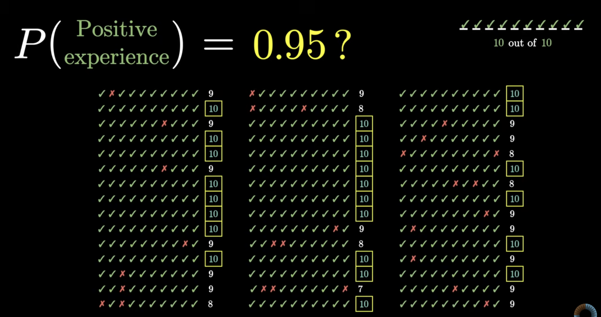

A **10/10** pattern is plausible for $S = 0.90$, $S = 0.99$, and other values; we cannot pin down $S$ from the reviews alone.

Our objective is to pick the seller with the best $S$, even though $S$ is unknown for each seller.

For each seller, $S$ could be any number in $[0, 1]$.
After seeing reviews, we need beliefs about **which values of $S$ are plausible**— a distribution on the parameter itself. This is what we mean by “probabilities of probabilities.”

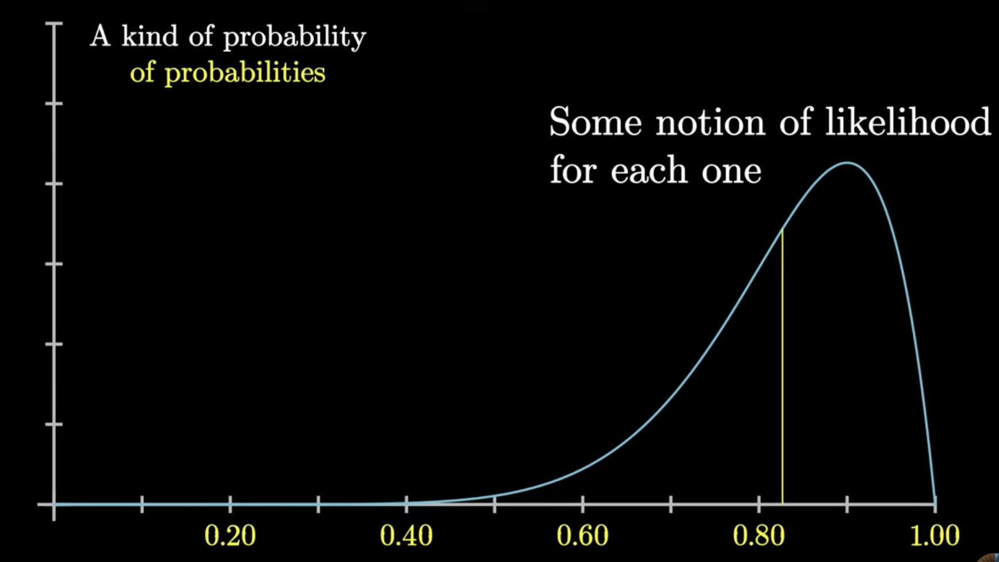

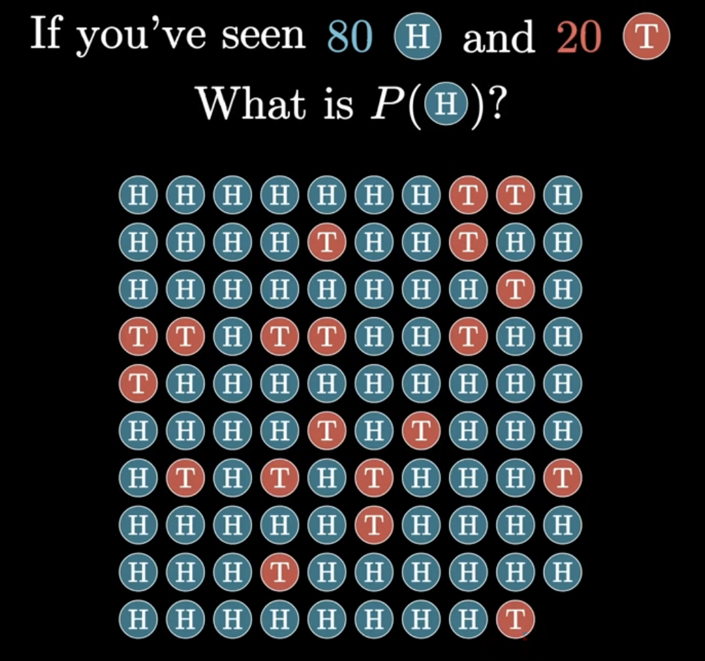

## When $S$ is known and fixed

Suppose we **knew** a seller's true success rate, say $S = 0.95$.
We could then compute the probability of any particular review record—$10$ positive and $0$ negative, or $48$ positive and $2$ negative out of $50$, or $186$ positive and $14$ negative out of $200$.
In general we want

$$P(\text{data} \mid S),$$

the probability of the **observed reviews** assuming success rate $S$.

Fix $n = 50$ independent reviews and $k = 48$ positives, with $S = 0.95$.
Each specific sequence with exactly $48$ successes and $2$ failures has probability

$$S^{48}(1-S)^{2} = 0.95^{48} \cdot 0.05^{2},$$

because we assume reviews are **independent** given $S$.

There are many distinct orderings of $48$ successes among $50$ slots (e.g. $48$ good then $2$ bad).
The number of such sequences is the binomial coefficient

$$\binom{50}{48} = 1225.$$

Multiplying count by probability per sequence,

$$P(48 \text{ positives} \mid S = 0.95, \, n = 50)
= \binom{50}{48} \, S^{48}(1-S)^{2}
\approx 0.261.$$

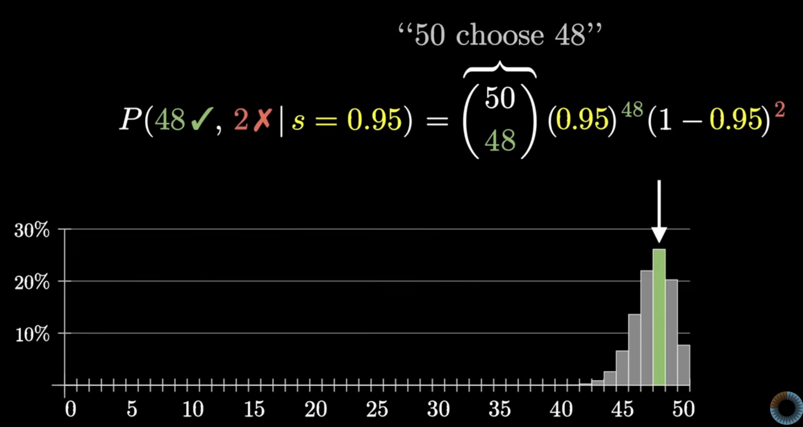

Replacing $48$ by any other $k \in \{0, 1, \ldots, 50\}$ gives the probability of **any** number of positive reviews out of $50$, still assuming fixed $S$.
The resulting family of probabilities over $k$ is the **binomial distribution**— one of the central discrete distributions in probability, developed further in [Random Variables](random_variables.md#binomial-distribution).

For our purposes, this formula gives us the probability of seeing the data given an assumed success rate.

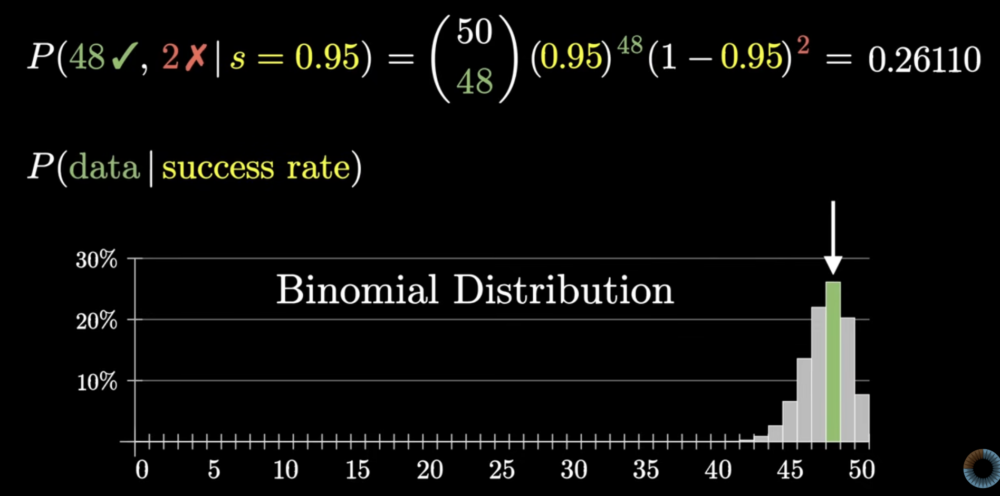

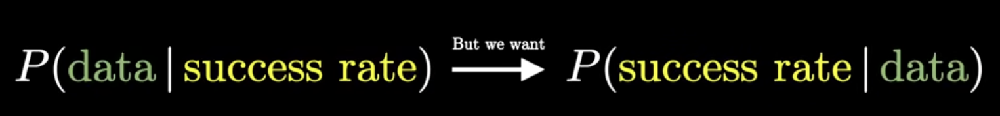

## When we vary $S$

We can vary the assumed success rate $S$ between $0$ and $1$ and see how the [**binomial distribution**](random_variables.md#binomial-distribution) over a **fixed number** of positive reviews changes.

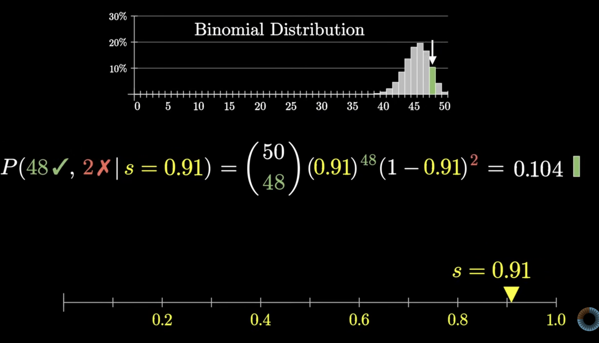

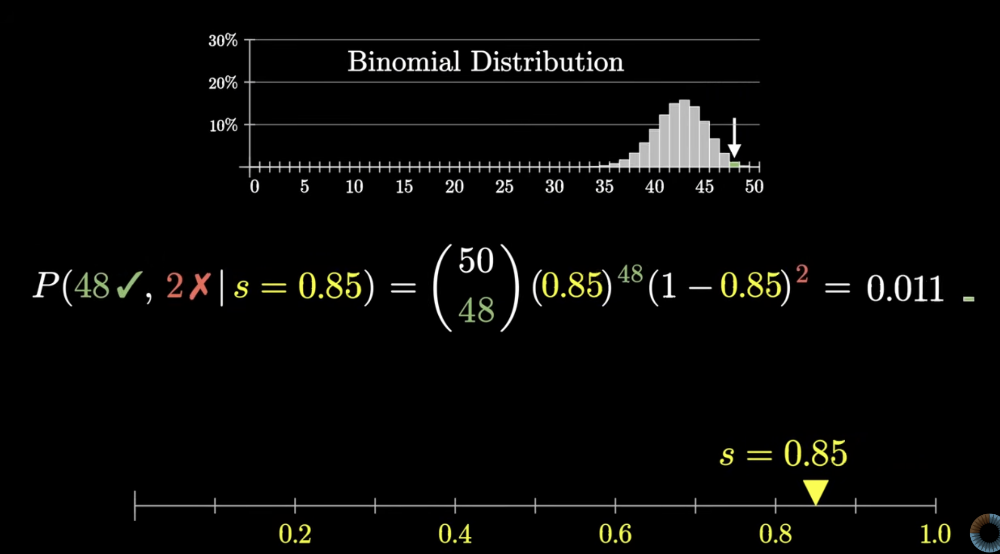

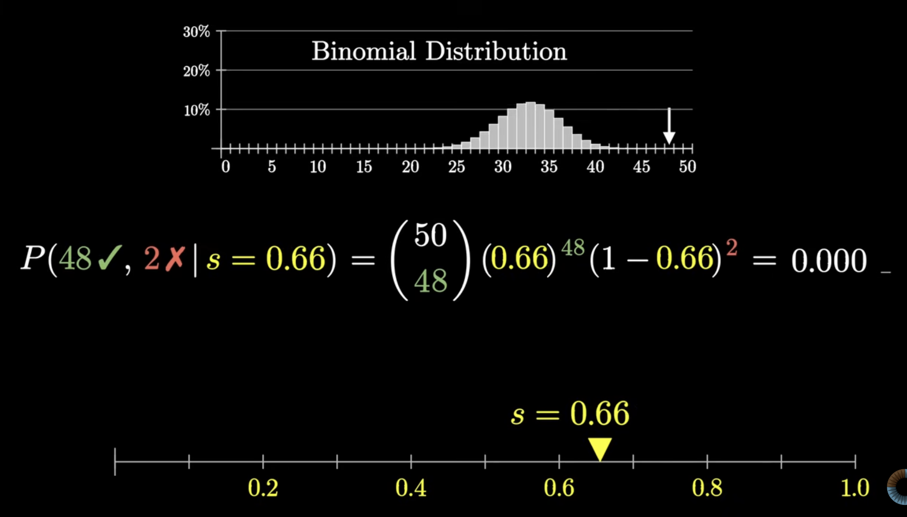

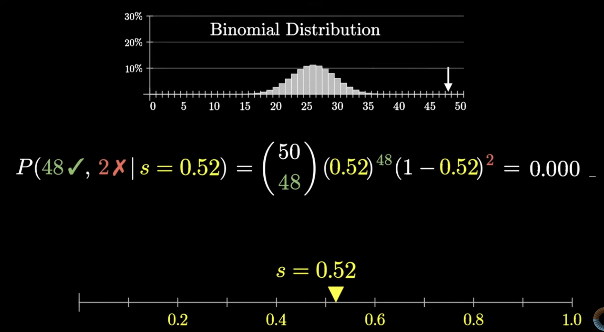

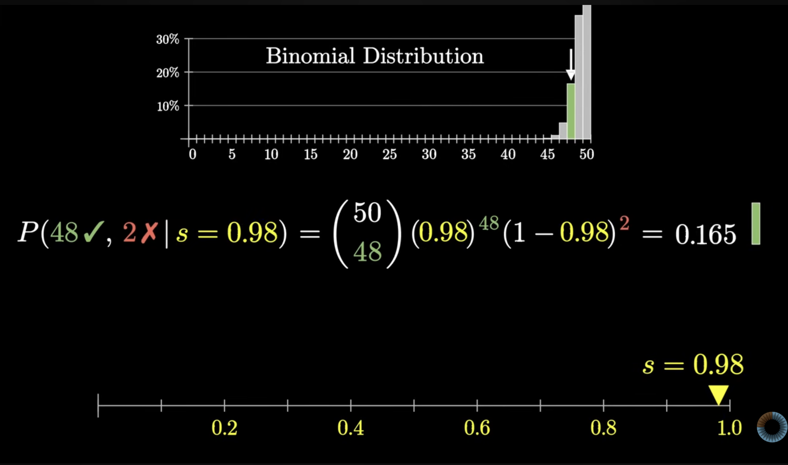

The value we care about, the probability of seeing $48$ out of $50$ reviews, is represented by this highlighted green bar in the above figures.

Let's draw a second plot representing how that value depends on $S$.

Plot

$$L(S) = P(48 \text{ positives} \mid S, \, n = 50)
= \binom{50}{48} \, S^{48}(1-S)^{2}$$

for $S \in [0,1]$.

From the plot, $L(S)$ is **largest** at $S = 0.96$.

!!! note "Calculus: location and height of the maximum"
    Write $L(S) = C \, S^{48}(1-S)^{2}$ with $C = \binom{50}{48} = 1225$ (constant in $S$).
    On $(0,1)$, maximizing $L(S)$ is equivalent to maximizing $\ell(S) = \log L(S)$, since $\log$ is increasing:

    $$\ell(S) = \log C + 48 \log S + 2 \log(1-S).$$

    Differentiate and set to zero:

    $$\frac{d\ell}{dS} = \frac{48}{S} - \frac{2}{1-S} = 0
    \quad \Longrightarrow \quad
    48(1-S) = 2S \quad \Longrightarrow \quad S = \frac{48}{50} = 0.96.$$

    So the **critical point** is at the observed success rate $k/n$.
    The second derivative

    $$\frac{d^{2}\ell}{dS^{2}} = -\frac{48}{S^{2}} - \frac{2}{(1-S)^{2}} < 0 \quad \text{for } S \in (0,1),$$

    so this critical point is a **maximum**.

    The **maximum value** is therefore

    $$L(0.96) = \binom{50}{48} (0.96)^{48}(0.04)^{2} \approx 0.261,$$

    matching the simulation and the plots above.

    **General rule**: for $n$ trials and $k$ successes, $L(S) \propto S^{k}(1-S)^{n-k}$ is maximized at $S = k/n$ by the same calculation with $48$ and $2$ replaced by $k$ and $n-k$.

That is the success rate for which our particular data are most probable.

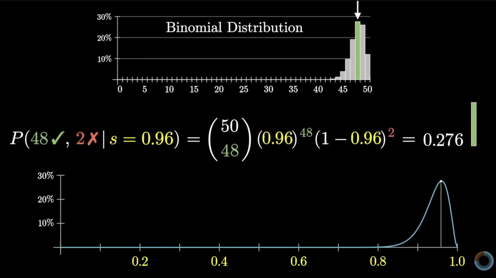

As $S \to 1$, we have $L(S) \to 0$: a seller with a perfect success rate would not produce two negative reviews.
As $S$ moves left, $L(S)$ also falls off quickly; for example, at $S = 0.8$ the probability of $48$ positives out of $50$ by chance is on the order of $10^{-2}$, which is exceedingly rare.

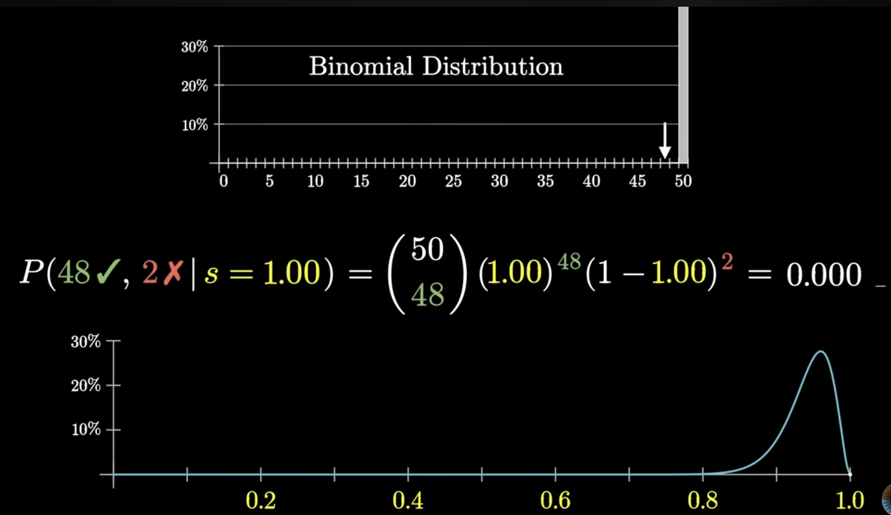
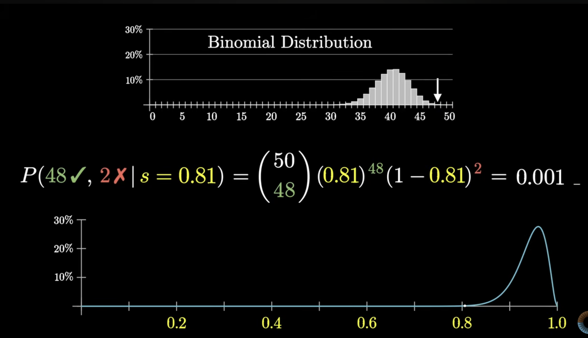

The curve $L(S)$ is a first quantitative summary of **which values of $S$ are plausible** after seeing the reviews.

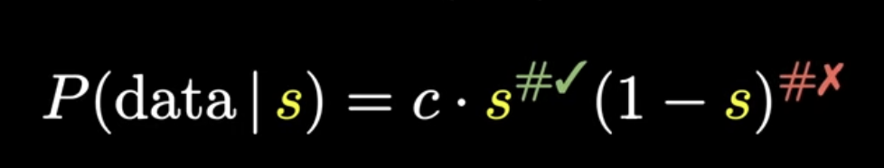

With more data in the same proportion— say $480$ positive and $20$ negative out of $n = 500$, the peak is still at $S = 480/500 = 0.96$, but the curve is **narrower**, **smaller**, and **more concentrated** around that value.

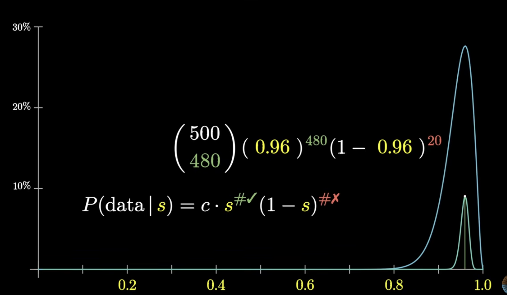

**Why?** $L(S) \propto S^{k}(1-S)^{n-k}$.
With the same fraction $k/n = 0.96$ but larger $n$, the exponents $k$ and $n-k$ are both scaled up.
The $L(S)$ multiplies one such factor for **each** success, so we are effectively multiplying **more numbers less than $1$** when $n$ is larger.
Each extra review adds another sub-unity factor to the product, so $L(S)$ shrinks faster as $S$ moves away from $0.96$.

More data sharpen our beliefs about which $S$ is plausible, even though no single full dataset can be very likely in absolute terms.

What do we do with the curves? We are still looking for the formulation below.

