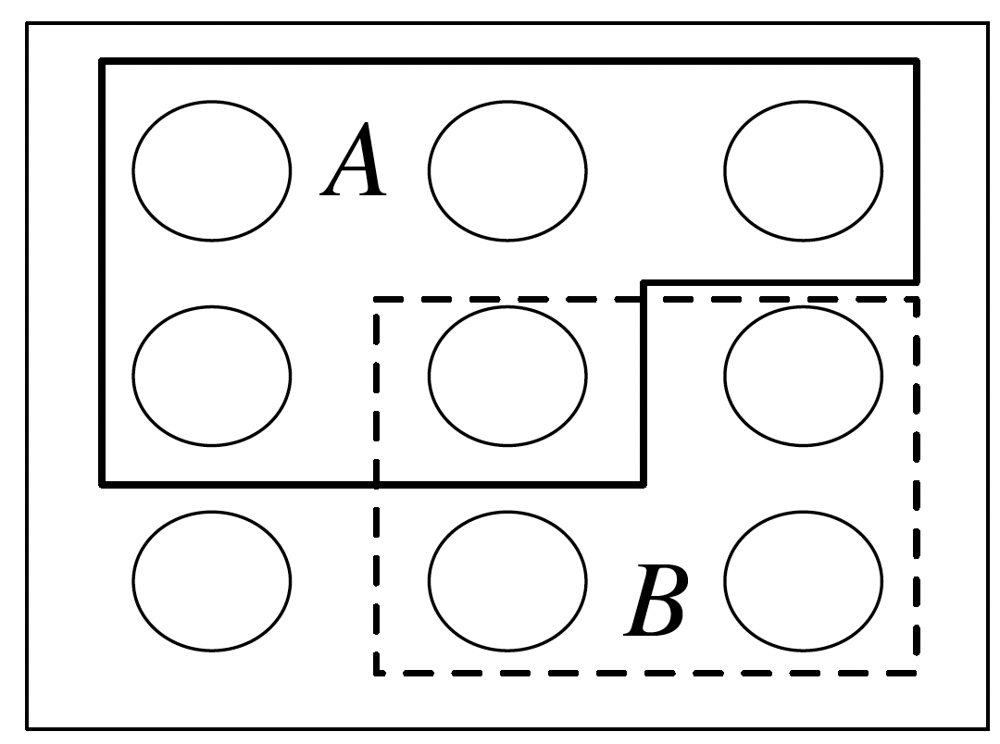
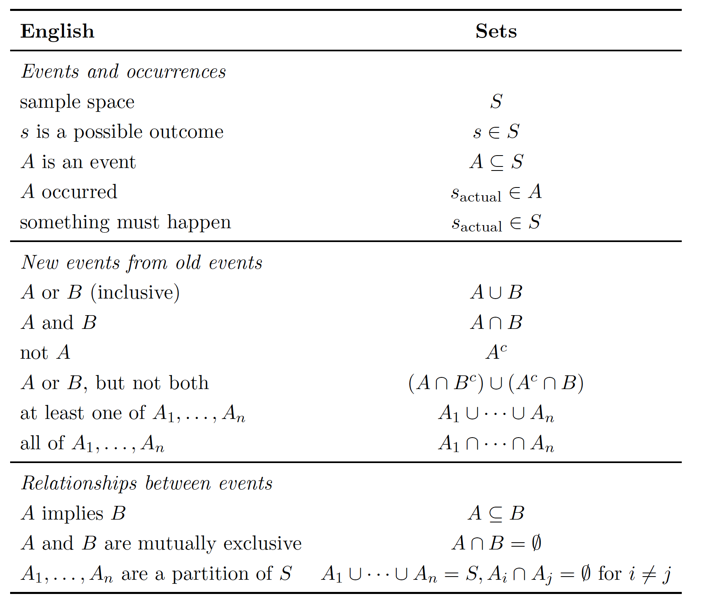

# Probability and counting

## Sample spaces
The mathematical framework for probability is built around sets. Imagine that an experiment is performed, resulting in one out of a set of possible outcomes. Before the experiment is performed, it is unknown which outcome will be the result; after, the result "crystallizes" into the actual outcome.
**The sample space S of an experiment is the set of all possible outcomes of the experiment. An event A is a subset of the sample space S, and we say that A occurred if the actual outcome is in A.**

When the sample space is finite, we can visualize it as Pebble World (figure above). Each pebble represents an outcome, and an event is a set of pebbles. Performing the experiment amounts to randomly selecting one pebble. If all the pebbles are of the same mass, all the pebbles are equally likely to be chosen.

Set theory is very useful in probability, since it provides a rich language for expressing and working with events. Set operations, especially unions, intersections, and complements, make it easy to build new events in terms of already defined events.

**Example**: 
A coin is flipped 10 times. Writing Heads as **H** and Tails as **T**, a possible outcome is: HHHTHHTTHT.
The sample space is the set of all possible strings of length 10 consisting of **H**'s and **T**'s.
We can (and will) encode **H** as `1` and **T** as `0`, so that an outcome is a sequence:
$$
(s_1, s_2, \dots, s_{10}) \quad \text{with} \quad s_j \in \{0, 1\}
$$
The sample space is the set of all such sequences.

Some events:

1. Event A_1: the first flip is Heads. As a set:
$$
A_1 =  (1, s_2, \dots, s_{10}) \; \mid \; s_j \in \{0,1\} \; \text{and } 2 \leq j \leq 10 
$$
This is a subset of the sample space, so it is indeed an event. Saying that A_1 occurs is equivalent to saying that the first flip is Heads. Similarly, let A_j be the event that the j-th flip is Heads, for:
$$
j = 2, 3, \dots, 10
$$
2. Event B: at least one flip was Heads. As a set:
$$
B = \bigcup_{j=1}^{10} A_j
$$
3. Event C: all the flips were Heads. As a set:
$$
C = \bigcap_{j=1}^{10} A_j
$$
4. Event D: there were at least two consecutive Heads. As a set:
$$
D = \bigcup_{j=1}^{9} \left( A_j \cap A_{j+1} \right)
$$

## Naive definition of probability

(Naive definition of probability). Let \( A \) be an event for an experiment with a finite sample space \( S \). The naive probability of \( A \) is

\[
P_{\text{naive}}(A) = \frac{|A|}{|S|} = \frac{\text{number of outcomes favorable to } A}{\text{total number of outcomes in } S}
\]

The naive definition is very restrictive in that it requires S to be finite, with equal mass for each pebble (all outcomes equally likely). It has often been misapplied by people who assume equally likely outcomes without justification and make arguments to the effect of “either it will happen or it won’t, and we don’t know which, so it’s 50-50”.

## Counting

The **multiplication rule** is a fundamental principle in counting that allows us to count the number of possible outcomes of a sequence of experiments.

**Multiplication Rule**: If Experiment 1 has $n_1$ possible outcomes, Experiment 2 has $n_2$ possible outcomes, ..., and Experiment $r$ has $n_r$ possible outcomes, then the sequence of all $r$ experiments has $n_1 \times n_2 \times \cdots \times n_r$ possible outcomes.

**Example**: A license plate consists of 3 letters followed by 3 digits. How many different license plates are possible?

- Experiment 1: Choose the first letter (26 outcomes)
- Experiment 2: Choose the second letter (26 outcomes) 
- Experiment 3: Choose the third letter (26 outcomes)
- Experiment 4: Choose the first digit (10 outcomes)
- Experiment 5: Choose the second digit (10 outcomes)
- Experiment 6: Choose the third digit (10 outcomes)

By the multiplication rule, the total number of possible license plates is: $26 \times 26 \times 26 \times 10 \times 10 \times 10 = 26^3 \times 10^3 = 17,576,000$

**Key insight**: The multiplication rule applies when the experiments are **independent**- the number of possible outcomes of each experiment doesn't depend on the outcomes of previous experiments.

**Example:** Probability of a Full House in Poker

A **full house** in poker consists of three cards of one rank and two cards of another rank (e.g., three Kings and two 7s). Let's calculate the probability of being dealt a full house in a 5-card hand from a standard 52-card deck.

**Step 1: Count the total number of possible 5-card hands**
- This is the number of ways to choose 5 cards from 52 cards
- Total hands = $\binom{52}{5} = \frac{52!}{5!(52-5)!} = \frac{52!}{5! \cdot 47!} = 2,598,960$

**Step 2: Count the number of full house hands**
We can break this down using the multiplication rule:

1. **Choose the rank for the three-of-a-kind**: 13 choices (A, 2, 3, ..., 10, J, Q, K)
2. **Choose 3 cards of that rank**: $\binom{4}{3} = 4$ ways (since there are 4 cards of each rank)
3. **Choose a different rank for the pair**: 12 choices (must be different from the three-of-a-kind rank)
4. **Choose 2 cards of that rank**: $\binom{4}{2} = 6$ ways

By the multiplication rule, the number of full house hands is: $13 \times 4 \times 12 \times 6 = 3,744$

**Step 3: Calculate the probability**
Using the naive definition of probability:

$$P(\text{Full House}) = \frac{\text{Number of full house hands}}{\text{Total number of hands}} = \frac{3,744}{2,598,960} = \frac{6}{4,165} \approx 0.00144$$

So the probability of being dealt a full house is approximately 0.144%, or about 1 in 694 hands.

## Sampling: Choosing $k$ Items from $n$ Items

When we want to choose $k$ items from a set of $n$ items, there are four fundamental cases depending on whether:

1. **Replacement**: Can we choose the same item multiple times?

2. **Order**: Does the order of selection matter?

This gives us four distinct sampling scenarios:

Case 1: Sampling with Replacement, Order Matters

- **Description**: Choose $k$ items from $n$ items, allowing repeats, where order matters

- **Example**: Rolling a die 3 times (can get same number multiple times, order matters)

- **Formula**: $n^k$

- **Derivation**: By the multiplication rule, each of the $k$ choices has $n$ possible outcomes, so total outcomes = $n \times n \times \cdots \times n = n^k$

Case 2: Sampling without Replacement, Order Matters

- **Description**: Choose $k$ items from $n$ items, no repeats, where order matters

- **Example**: Choosing 3 people from 10 to be president, vice-president, and treasurer

- **Formula**: $P(n,k) = \frac{n!}{(n-k)!} = n \times (n-1) \times (n-2) \times \cdots \times (n-k+1)$

- **Derivation**: First choice has $n$ options, second choice has $(n-1)$ options (can't repeat), third choice has $(n-2)$ options, etc. By multiplication rule: $n \times (n-1) \times (n-2) \times \cdots \times (n-k+1) = \frac{n!}{(n-k)!}$

Case 3: Sampling without Replacement, Order Doesn't Matter

- **Description**: Choose $k$ items from $n$ items, no repeats, where order doesn't matter

- **Example**: Choosing 3 people from 10 to be on a committee

- **Formula**: $\binom{n}{k} = \frac{n!}{k!(n-k)!}$

- **Derivation**: This is the number of combinations. We start with Case 2- ($P(n,k)$) and divide by $k!$ because each group of $k$ items can be arranged in $k!$ different orders, but we only want to count each group once.

Case 4: Sampling with Replacement, Order Doesn't Matter

- **Description**: Choose $k$ items from $n$ items, allowing repeats, where order doesn't matter

- **Example**: Choosing 3 scoops of ice cream from 4 flavors, where you can get multiple scoops of the same flavor (e.g., 2 chocolate and 1 vanilla)

- **Formula**: $\binom{n+k-1}{k} = \binom{n+k-1}{n-1}$

- **Derivation**: Let's derive the formula using a visual approach. Imagine we have 3 scoops (represented by x's) and 4 flavors (separated by dividers |). For example, xx|x|| means 2 scoops of flavor 1, 1 scoop of flavor 2, and 0 scoops of flavors 3 and 4. We need to arrange 3 x's and 3 dividers (to create 4 sections) in a total of 6 positions. Now, in these 6 positions, we place 3 scoops. Once the 3 scoops (x) are placed, the dividers (|) are automatically determined. A few examples to illustrate this:

- xxx||| means 3 scoops of flavor 1, 0 scoops of flavors 2, 3, and 4
- x|x|x| means 1 scoop of each flavor and 0 scoops of flavor 4
- ||xxx| means 0 scoops of flavors 1 and 2, 3 scoops of flavor 3, 0 scoops of flavor 4

The key insight is that we're choosing 3 positions out of 6 total positions to place our scoops (x's). The number of ways to do this is $\binom{6}{3} = 20$. 

In general, for $k$ scoops and $n$ flavors, we have $(k + n - 1)$ total positions and we need to choose $k$ positions for the scoops. This gives us $\binom{k + n - 1}{k} = \binom{n + k - 1}{k}$.

**Summary Table**:

| Replacement | Order Matters | Formula | Name |
|-------------|---------------|---------|------|
| With | Yes | $n^k$ | Permutations with replacement |
| Without | Yes | $\frac{n!}{(n-k)!}$ | Permutations without replacement |
| Without | No | $\frac{n!}{k!(n-k)!}$ | Combinations |
| With | No | $\binom{n+k-1}{k}$ | Combinations with replacement |

**Example:** Splitting 10 People into teams

Case 1: Distinguishable teams (Team A and Team B)

Suppose we want to split 10 people into two teams: Team A with 6 people and Team B with 4 people.

**Question**: How many ways can we do this?

**Solution**: We need to choose 6 people out of 10 for Team A. The remaining 4 people automatically go to Team B. The number of ways is:

$$\binom{10}{6} = \frac{10!}{6! \cdot 4!} = \frac{10 \times 9 \times 8 \times 7}{4 \times 3 \times 2 \times 1} = 210$$

Case 2: Indistinguishable teams

Now suppose we want to split 10 people into two teams of 5, but the teams are indistinguishable (no Team A vs Team B).

**Question**: How many ways can we do this?

**Solution**: Since the teams are indistinguishable, we've double-counted each arrangement. For example, the arrangement where people {1,2,3,4,5} are on one team and {6,7,8,9,10} are on the other is the same as the arrangement where {6,7,8,9,10} are on one team and {1,2,3,4,5} are on the other.

The number of ways is:

$$\frac{\binom{10}{6}}{2} = \frac{210}{2} = 105$$

For unequal-sized groups (like 6 and 4), the two sides of the split are inherently distinguishable due to their sizes.