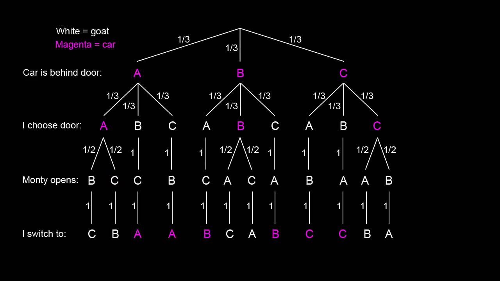
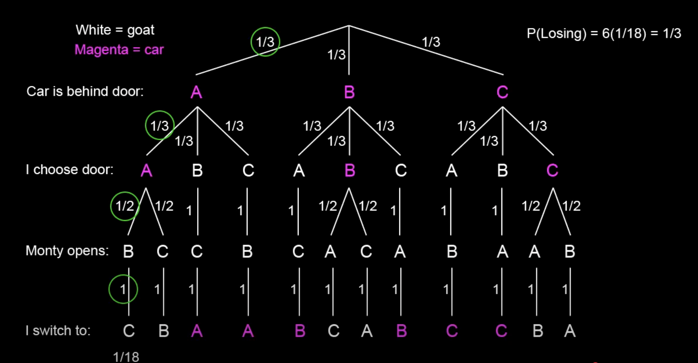
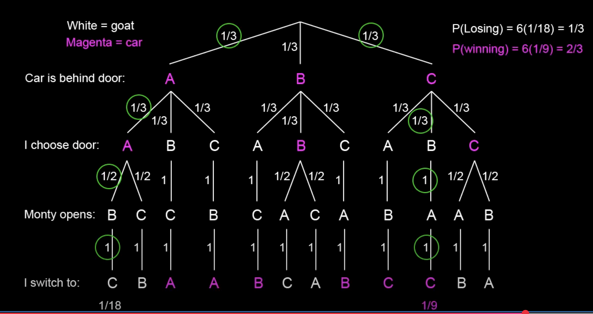
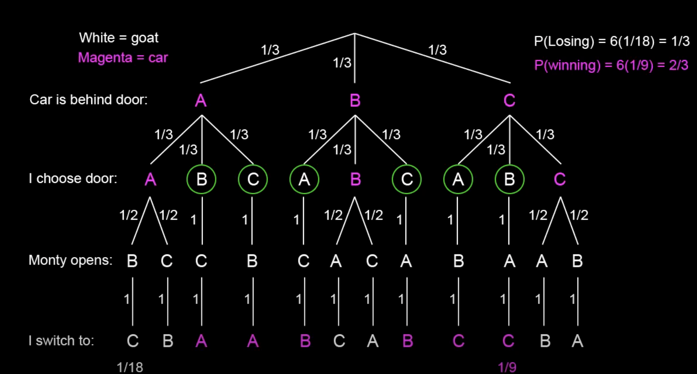

# Some famous problems

## The Monty Hall Problem

The Monty Hall Problem is a famous probability puzzle named after the host of the television game show "Let's Make a Deal." It demonstrates how our intuition about probability can be misleading and how conditional probability can lead to counterintuitive results.

You are a contestant on a game show. There are three doors:

- **Door 1**: Behind one door is a car (the prize you want)

- **Door 2**: Behind another door is a goat

- **Door 3**: Behind the third door is another goat

You pick a door (say Door 1). The host, who knows what's behind each door, opens another door (say Door 3) to reveal a goat. The host then asks: "Do you want to switch to the remaining unopened door (Door 2)?"

**Question**: Should you switch doors to maximize your probability of winning the car?

Many people think that after one door is revealed, there are only two doors left, so the probability of winning the car is $\frac{1}{2}$ regardless of whether you switch or stay. This reasoning is **incorrect**.

Correct Solution: always switch!

The optimal strategy is to **always switch**. When you switch, your probability of winning the car is $\frac{2}{3}$, while if you stay with your original choice, your probability is only $\frac{1}{3}$.

The above tree diagram shows all the paths the game is played with the probabilities. The two diagrams below show the probabilities for winning and losing if we **always switch**.

Let's look at some logical reasoning to gain intuition. If we picked a goat first (diagram below), and decided to always switch, we are guaranteed to win! So the probability of winning is the probability of picking a goat first. Picking a goat first has the probability $\frac{2}{3}$. And if we pick a car first, and decided to always switch, we are guaranteed to lose! So the probability of losing is the probability of picking a car first. Picking a car first has the probability $\frac{1}{3}$.

Let's use the **Law of Total Probability** to formally calculate the probability of success when our strategy is to always switch. Let's assume we initially pick door 1. The soultion is symmetric if we pick any other door initially.

- Let $S$ be the event "We win by switching"

- Let $D_j$ be the event "The car is behind door $j$" for $j = 1, 2, 3$

The law of total probability states that:

$$P(S) = P(S|D_1)P(D_1) + P(S|D_2)P(D_2) + P(S|D_3)P(D_3)$$

**1. $P(S|D_1)$ - Probability of winning by switching given car is behind Door 1**

- If the car is behind Door 1, we initially picked the correct door

- When we switch, we must switch to a door with a goat

- Therefore, $P(S|D_1) = 0$

**2. $P(S|D_2)$ - Probability of winning by switching given car is behind Door 2**

- If the car is behind Door 2, we initially picked Door 1 (incorrect)

- Monty opens Door 3 (revealing a goat)

- When we switch, we switch to Door 2 (which has the car)

- Therefore, $P(S|D_2) = 1$

**3. $P(S|D_3)$ - Probability of winning by switching given car is behind Door 3**

- If the car is behind Door 3, we initially picked Door 1 (incorrect)

- Monty opens Door 2 (revealing a goat)

- When we switch, we switch to Door 3 (which has the car)

- Therefore, $P(S|D_3) = 1$

**4. Prior Probabilities**

- $P(D_1) = \frac{1}{3}$ (car equally likely to be behind any door initially)

- $P(D_2) = \frac{1}{3}$

- $P(D_3) = \frac{1}{3}$

Substituting into the law of total probability:

$$P(S) = P(S|D_1)P(D_1) + P(S|D_2)P(D_2) + P(S|D_3)P(D_3)$$

$$P(S) = 0 \cdot \frac{1}{3} + 1 \cdot \frac{1}{3} + 1 \cdot \frac{1}{3}$$

$$P(S) = 0 + \frac{1}{3} + \frac{1}{3} = \frac{2}{3}$$

The law of total probability provides a rigorous mathematical foundation for why the switching strategy is optimal.

To build stronger intuition for why switching is optimal, consider this thought experiment:

**Scenario**: There are **1,000,000 doors**. Behind one door is a car, and behind the other 999,999 doors are goats.

1. **You pick one door** (say Door 1)
2. **The host opens 999,998 doors**, revealing goats behind each one
3. **Two doors remain**: Your original choice (Door 1) and one other door (say Door 535,780)
4. **The host asks**: "Do you want to switch to the remaining unopened door?"

**Intuition**: In this case, it seems very intuitive to always switch because the probability that your initial pick is the car is literally **1 in a million**!

The same logic applies to the original 3-door problem, just on a smaller scale. The million doors experiment helps us see that the 3-door problem is not a special case - it's a general principle that applies regardless of the number of doors.

## Simpson's Paradox

Simpson's Paradox is a statistical phenomenon where a trend appears in different groups of data but disappears or reverses when these groups are combined. This paradox demonstrates how aggregating data can sometimes hide important underlying relationships and why it's crucial to examine data at multiple levels.

Simpson's Paradox occurs when **Group A** shows a trend in one direction, **Group B** shows the same trend in the same direction but the **combined data** shows the trend in the opposite direction.

This happens because of **confounding variables** that affect the relationship between the variables of interest.

**Example:**

| Gender | Department A  | Department B | Overall        |
|--------|---------------|--------------|----------------|
|        | Admit Rate    | Admit Rate   | Admit Rate     |
| Men    | 300/400 (75%) | 50/100 (50%) | 350/500 (70%)  |
| Women  | 100/100 (100%)| 25/100 (25%) | 125/200 (62.5%)|

**Analysis by Department:**
**Department A**: Women (100%) > Men (75%)
**Department B**: Women (25%) < Men (50%)

**Overall Analysis:**
**Combined**: Men (70%) > Women (62.5%)

**This is Simpson's Paradox!** Women have higher admission rates in both departments individually, but men have a higher overall admission rate.

Let's denote:

- $p_{ij}$ = admission rate for gender $i$ in department $j$

- $n_{ij}$ = number of applicants for gender $i$ in department $j$

**Overall admission rate for gender $i$:**

$$P_i = \frac{\sum_j n_{ij} p_{ij}}{\sum_j n_{ij}}$$

The paradox occurs when:

- $p_{1A} > p_{2A}$ and $p_{1B} > p_{2B}$ (women win in each department)

- But $P_1 < P_2$ (men win overall)

This happens because the $n_{ij}$ values (group sizes) create different weights in the overall calculation.

Simpson's Paradox teaches us that **aggregated data can be misleading**. The relationship between variables can change dramatically when we combine different groups, especially when those groups have different sizes or characteristics. This is why it's essential to examine data both individually and collectively to understand the true underlying relationships.

